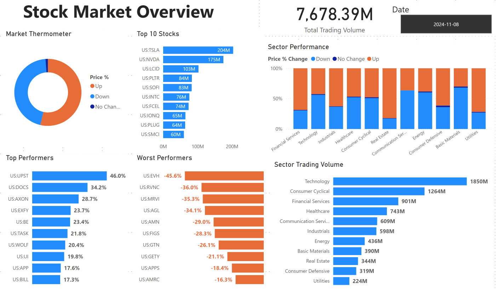
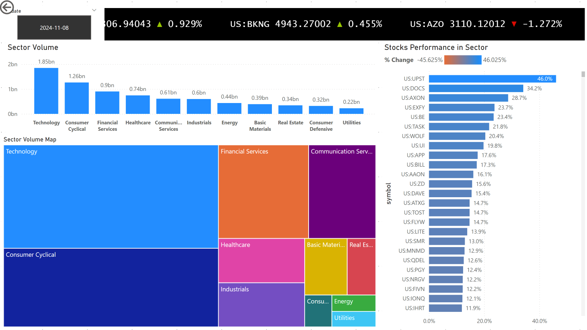
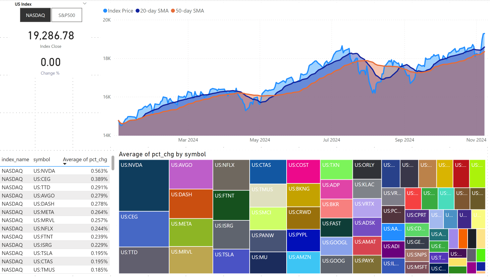
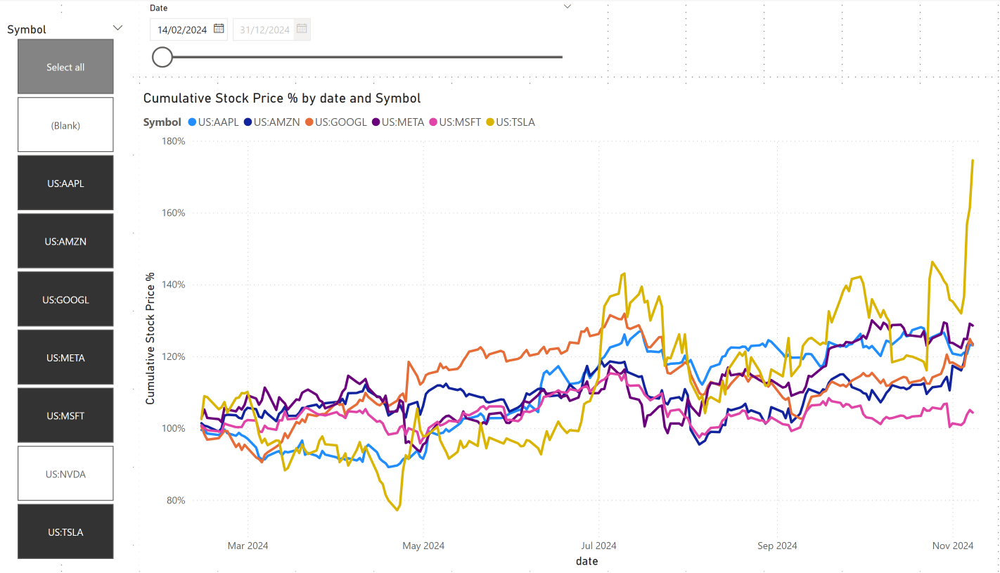
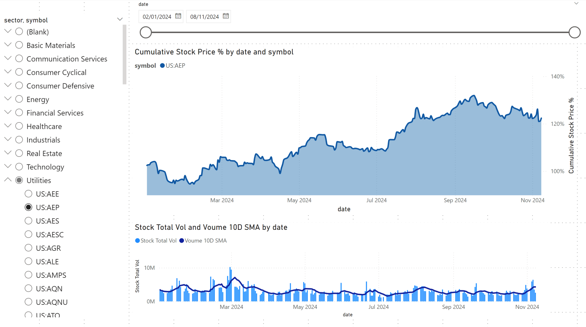

# Stock Market Analysis in Power BI

This project aims to practice skills around Power BI from scratch, which includes data modelling, transforming data and working on visuals.

1. Overview of Stock Market
This page shows:
- list of top and worst performing stocks 
- most traded stocks and their traded volume
- total trading volume by sector
- total trading volume for all stocks
- advance and declined stocks statistics (whole market as well as by sector)

2. Sector page shows:
- total trading volume by sector
- scroller of all stocks with closing price, and percentage change
- sector map by volume
- performances (percentage change) of stocks in descending order

3. Indexes shows:
- NASDAQ or S&P500 historical closing price, 20-day or 50-day moving average
- Stocks performance within the selected index
- Stock performance heatmap within the selected index

4. Magnificent 7 shows:
- Historical cumulative price change comparison on 7 stocks

5. Stock page shows:
- Drop down list of stocks by sector
- Historical price of the selected stock and volume

